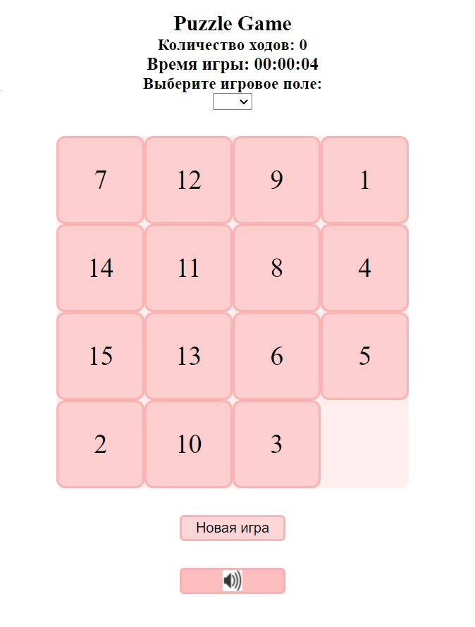

# Task 5. Game-puzzle от [RSS School](https://rs.school/)

### **Проект Game-puzzle [(готовый)](https://marinatwice82.github.io/game-puzzle/)**

### Правила игры

Игра представляет собой набор одинаковых квадратных костяшек с нанесёнными числами, заключённых в квадратную коробку. Длина стороны коробки в четыре раза больше длины стороны костяшек для набора из 15 элементов, соответственно в коробке остаётся незаполненным одно квадратное поле. Цель игры — перемещая костяшки по коробке, добиться упорядочивания их по номерам, желательно сделав как можно меньше перемещений

### Основные функциональные требования

* дизайн на свое усмотрение, но должен быть адаптивный (декстоп, планшет, мобильный), при переходе между версиями все должно отображаться корректно, должен присутствовать весь функционал, ничего не должно пропадать, уезжать за пределы экрана;
* изначально body в файле index.html должен быть пустой, все необходимые элементы генерируются с использованием JS;
* размер поля по умолчанию 4х4;
* состояние игрового поля генерируется случайным образом забивается числами при запуске новой игры цифры перемешиваются (следует учитывать, что не все перемешивания случайным образом будут иметь решение);
* игру можно начать заново без перезагрузки страницы;
* реализовать отображение продолжительности игры в минутах и секундах "##:##" и количество ходов;
* реализовать возможности сохранения игры (например, с помощью localStorage), чтобы при перезагрузке страницы иметь возможность продолжить с того же места где остановился.

### [Описание задания](https://github.com/rolling-scopes-school/tasks/blob/master/tasks/gem-pazzle/codejam-the-gem-puzzle.md)
